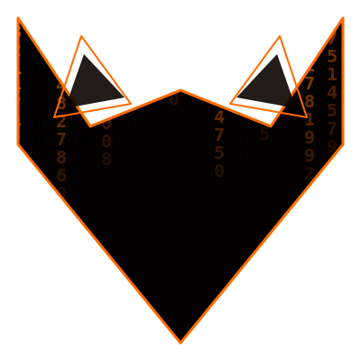

<p align="center">
  
</p>

<h1 align="center">Nightion</h1>

<p align="center">
  <strong>A fully offline AI coding assistant — built by Nitin</strong>
</p>

<p align="center">
  
  
  
  
  
  
</p>

---

## What is Nightion?

Nightion is a **privacy-first, fully offline** AI coding assistant that runs entirely on your local machine. No cloud APIs, no telemetry to external servers, no data ever leaving your device. It uses the **gemma4** language model served by [Ollama](https://ollama.com) and provides a rich web-based interface powered by FastAPI.

### Key Capabilities

| Feature | Description |
|---|---|
| 💬 **AI Chat** | Conversational assistant with real-time streaming & reasoning transparency |
| 🧠 **Code Generation** | Context-aware code gen with RAG (Retrieval-Augmented Generation) |
| 📐 **DSA Problem Solving** | Structured approach: restate → pattern → brute force → optimize → edge cases |
| 👁️ **See & Code** | Screenshot any coding problem → AI reads it → generates & auto-types the solution |
| 🖱️ **Smart Cursor** | System-wide hotkey (Ctrl+Shift+0) to capture screen regions and type answers anywhere |
| 🎙️ **Voice Mode** | Voice interaction with animated fox character & speech synthesis |
| 🖥️ **Desktop Control** | Open/close 40+ native Windows apps via natural language |
| 🔍 **Vector Search** | ChromaDB + sentence-transformers for semantic knowledge retrieval |
| 🧩 **Knowledge Graph** | Persistent concept graph with confidence dynamics & bidirectional edges |
| 📊 **Telemetry Dashboard** | Full trace logging with per-request inspection |

---

## Design Principles

- **🔒 Privacy-first** — All processing happens locally. Zero data leaves your machine.
- **📴 Offline-first** — Every feature works without an internet connection.
- **🛡️ Safety-first** — Multi-layer security: guards, sandboxes, capability gates, and a tri-state verifier prevent destructive actions.
- **⚡ Streaming** — Real-time token streaming over WebSocket for both reasoning and response tokens.

---

## Architecture

```
┌──────────────────────────────────────────────────────────────┐
│                    FRONTEND (Browser)                        │
│  index.html · app.js · style.css · mode_switcher.js          │
│  WebSocket /ws/chat  ·  REST APIs                            │
└─────────────────────────┬────────────────────────────────────┘
                          │ HTTP / WebSocket
┌─────────────────────────▼────────────────────────────────────┐
│              nightion_core.py (FastAPI)                       │
│  Routes · WebSocket handler · Static file serving             │
└─────────────────────────┬────────────────────────────────────┘
                          │
┌─────────────────────────▼────────────────────────────────────┐
│              orchestrator.py                                  │
│  Conversation context · Ollama streaming · Think-mode          │
└─────────────────────────┬────────────────────────────────────┘
                          │
┌─────────────────────────▼────────────────────────────────────┐
│              Ollama (localhost:11434)                          │
│  gemma4 · Streaming NDJSON · Thinking + Response fields       │
└──────────────────────────────────────────────────────────────┘

 Supporting Layers:
 ┌──────────────┐  ┌──────────────┐  ┌──────────────────┐
 │ tool_router  │  │ llm_adapter  │  │  memory_core     │
 │ Intent via   │  │ RAG + smart  │  │  SQLite truth    │
 │ vectors      │  │ fallback     │  │  graph           │
 └──────────────┘  └──────────────┘  └──────────────────┘
 ┌──────────────┐  ┌──────────────┐  ┌──────────────────┐
 │ vector_store │  │   guards     │  │   verifier       │
 │ ChromaDB +   │  │ Safety gates │  │ Tri-state output │
 │ MiniLM-L6-v2 │  │ & risk eval  │  │ validation       │
 └──────────────┘  └──────────────┘  └──────────────────┘
```

---

## Quick Start

### Prerequisites

- **Python 3.10+**
- **[Ollama](https://ollama.com)** installed with the `gemma4` model pulled:
  ```bash
  ollama pull gemma4
  ```

### Installation

```bash
# Clone the repository
git clone https://github.com/your-username/Nightion.git
cd Nightion

# Install Python dependencies
pip install -r requirements.txt
```

### Run

**Option 1 — One-click launcher (Windows):**
```
Double-click nightion.bat
```
This will:
1. Kill any existing process on port 8999
2. Restart Ollama
3. Start the FastAPI server with hot-reload
4. Open http://127.0.0.1:8999 in your browser
5. Launch the Smart Cursor background listener

**Option 2 — Manual:**
```bash
# Start Ollama (if not already running)
ollama serve

# Start Nightion
uvicorn nightion_core:app --host 0.0.0.0 --port 8999 --reload
```

Then open **http://127.0.0.1:8999** in your browser.

---

## Project Structure

```
Nightion/
├── nightion_core.py          # FastAPI app — main entry point
├── orchestrator.py           # Query orchestration & Ollama streaming
├── tool_router.py            # Semantic intent classification (vector-based)
├── llm_adapter.py            # Hybrid RAG intelligence brain
├── schemas.py                # Pydantic data models & enums
├── config.py                 # Environment-based config (dev/staging/prod)
│
├── memory_core.py            # SQLite truth graph (session chat, facts)
├── memory_manager.py         # JSON-based stable memory
├── knowledge_base.py         # Topic-hashed knowledge store (SHA-256)
├── knowledge_graph.py        # Concept graph with confidence dynamics
├── vector_store.py           # ChromaDB + sentence-transformers
├── context_injector.py       # Knowledge context injection into prompts
├── retrieval_governor.py     # Domain-filtered retrieval
│
├── guards.py                 # Action risk evaluation & safety pre-checks
├── sandbox.py                # Isolated Python execution environment
├── coding_sandbox.py         # Patch-based code modification sandbox
├── capability_policy.py      # Capability levels & execution gates
├── tool_permissions.py       # Tool permission contracts
├── verifier.py               # Tri-state output verification
│
├── tool_action_manager.py    # Central tool execution registry
├── desktop_action_manager.py # Native Windows app launcher (40+ apps)
├── see_and_code.py           # Vision → code gen → human-like auto-typing
├── smart_cursor.py           # System-wide hotkey screen capture & typing
│
├── tools/                    # Tool adapters
│   ├── code_runner.py        #   Python code execution
│   ├── search.py             #   Web search (stub)
│   └── desktop.py            #   Desktop/app control
│
├── static/                   # Frontend (vanilla HTML/CSS/JS)
│   ├── index.html            #   Main chat UI
│   ├── app.js                #   Chat logic & WebSocket handler
│   ├── style.css             #   Dark theme, glassmorphism, animations
│   ├── mode_switcher.js      #   Chat/Writer/Voice mode switching
│   ├── writer_mode.js        #   See & Code writer mode
│   ├── smart_cursor.js       #   Smart Cursor frontend
│   ├── voice_mode.js         #   Voice mode with animated fox
│   ├── logs.js               #   Telemetry trace viewer
│   └── logs_dashboard.html   #   Telemetry dashboard
│
├── prompts/                  # System prompt templates
├── tests/                    # 37 test files (pytest)
├── evals/                    # Evaluation harness & datasets
├── scripts/                  # Utility scripts (release gate, db backup)
│
├── Dockerfile                # Container build (Playwright base image)
├── nightion.bat              # Windows one-click launcher
├── system_protocol.md        # Core behavioral rules
└── documentation.txt         # Full project documentation (76KB)
```

---

## Modes

### 💬 Chat Mode
Standard conversational AI interface with real-time token streaming, reasoning transparency (collapsible thinking blocks), markdown rendering, and code syntax highlighting.

### ✍️ Writer Mode (See & Code)
1. Capture a screenshot of any coding problem
2. AI analyzes the image using gemma4 vision
3. Generates a complete, working solution
4. Auto-types the code into any editor with human-like timing (typos, bursts, realistic delays)

### 🎙️ Voice Mode
Voice interaction with an animated fox character, matrix-style background, speech synthesis, and visual state transitions.

### 🖱️ Smart Cursor
Press **Ctrl+Shift+0** anywhere on your desktop to:
1. Select a screen region (snipping-tool style)
2. AI reads and analyzes the content
3. Click any text field and the answer is typed automatically

---

## Security Model

Nightion implements **defense-in-depth** with multiple independent safety layers:

| Layer | Module | Function |
|---|---|---|
| **Pre-check** | `guards.py` | Blocks destructive queries before any processing |
| **Intent Safety** | `tool_router.py` | False-positive blocking for app control intent |
| **Capability Gates** | `capability_policy.py` | 4-tier capability levels (Isolated → Elevated) |
| **Sandbox** | `sandbox.py` | Blocked imports, subprocess isolation, timeout |
| **Patch Safety** | `coding_sandbox.py` | AST validation, file boundary checks, size limits |
| **Tool Contracts** | `tool_permissions.py` | Per-tool confirmation requirements |
| **Output Verification** | `verifier.py` | Tri-state validation (PASS/FAIL/UNCERTAIN) |

---

## API Reference

### REST Endpoints

| Method | Path | Description |
|---|---|---|
| `GET` | `/` | Serve main UI |
| `GET` | `/api/ping` | Health ping |
| `GET` | `/api/health` | System health (Ollama status, model) |
| `GET` | `/api/stats` | System statistics |
| `GET` | `/api/config` | Runtime configuration |
| `POST` | `/api/execute` | Execute code in sandbox |
| `DELETE` | `/api/history` | Clear conversation history |
| `GET` | `/api/session/history` | Session chat history |
| `POST` | `/api/screenshot` | Capture screen + vision analysis |
| `POST` | `/api/see-and-code` | Full pipeline: screenshot → code |
| `POST` | `/api/type-humanlike` | Human-like typing |
| `POST` | `/api/type-humanlike/cancel` | Cancel typing session |
| `GET` | `/api/traces` | List all trace IDs |
| `GET` | `/api/traces/{id}` | Full trace details |

### WebSocket

| Path | Description |
|---|---|
| `WS /ws/chat` | Streaming chat |

**Client → Server:**
```json
{ "message": "...", "use_rag": true, "session_id": "default_session" }
```

**Server → Client:**
```json
{ "type": "think_token", "content": "..." }
{ "type": "token", "content": "..." }
{ "type": "done", "rag_used": true, "trace_id": "..." }
```

---

## Testing

37 test files covering core functionality, safety proofs, adversarial cases, chaos engineering, failure injection, integration, and performance.

```bash
# Run all tests
pytest tests/ -v

# Run safety tests only
pytest tests/test_safety_proofs.py tests/test_sandbox_malicious.py -v

# Run with verbose output
pytest tests/ -v --tb=long
```

---

## Configuration

### Environment Tiers

Set the `NIGHTION_ENV` environment variable:

| Environment | `DEBUG` | `MAX_RETRIES` | Notes |
|---|---|---|---|
| `dev` (default) | `True` | `2` | WAL journal mode |
| `staging` | `True` | `1` | Reduced timeouts |
| `prod` | `False` | `3` | Full timeouts |

### Runtime Config (`config.json`)

- **js_rendered_domains** — Domains requiring JavaScript rendering (GeeksforGeeks, LeetCode, etc.)
- **voice_mode** — Fox sizes, animation speeds, theme color, countdown duration

---

## Docker

```bash
docker build -t nightion .
docker run -p 8999:8999 nightion
```

> **Note:** The Docker image uses the Microsoft Playwright base image and runs as a restricted non-root user (`nightion_sandbox`).

---

## Tech Stack

| Component | Technology |
|---|---|
| Language Model | gemma4 via [Ollama](https://ollama.com) |
| Backend | Python 3.10+ · FastAPI · Uvicorn |
| Frontend | Vanilla HTML/CSS/JS |
| Vector Store | ChromaDB + all-MiniLM-L6-v2 |
| Database | SQLite (WAL mode) |
| Vision | gemma4 multimodal |
| Auto-typing | pynput · pyautogui |
| Screen Capture | mss · pyautogui |
| Testing | pytest |
| Containerization | Docker (Playwright base) |

---

## License

This project is developed by **Nitin** as a solo developer project.

---

<p align="center">
  <sub>Built with 🦊 by Nitin — fully offline, fully private, fully yours.</sub>
</p>
